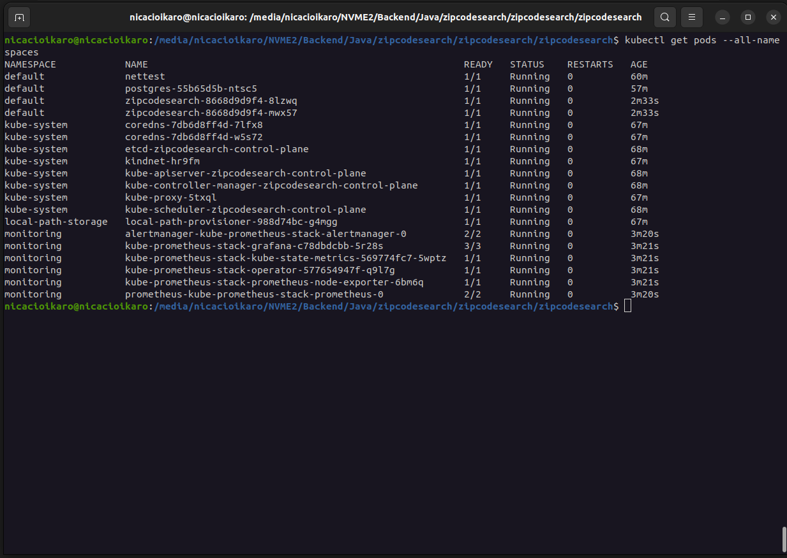
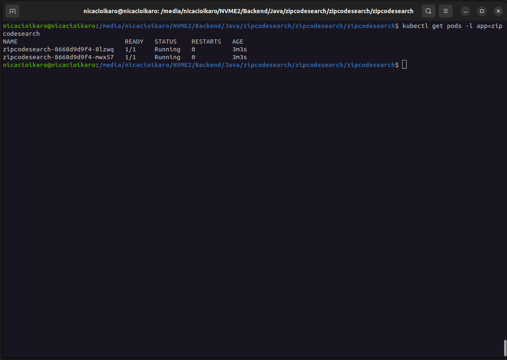
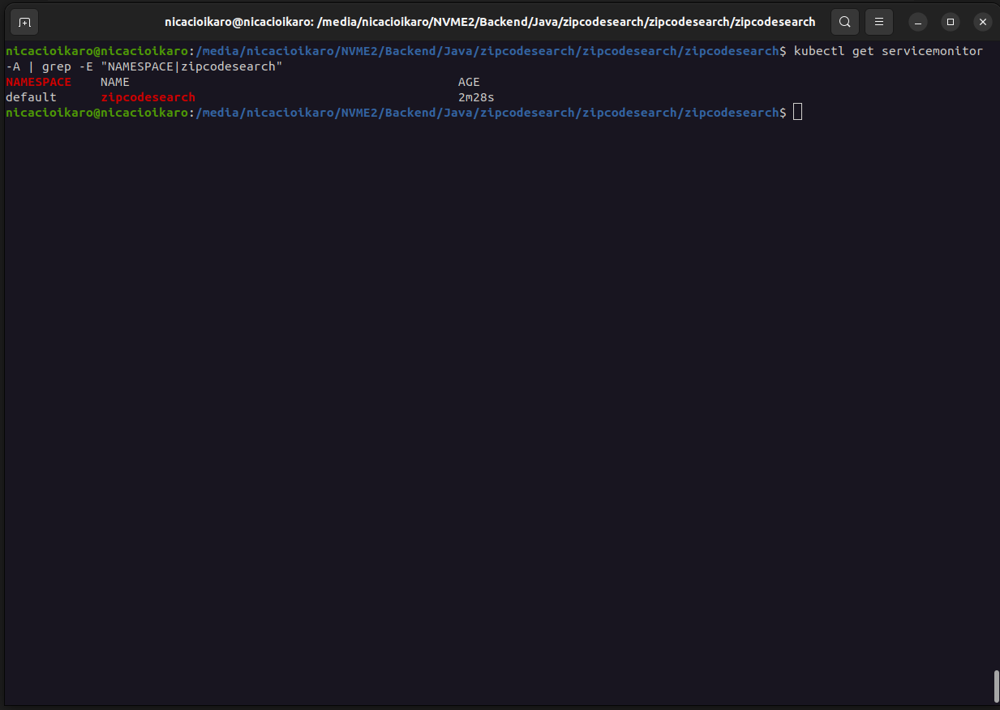

# Kubernetes Deployment

Manifests for running **zipcodesearch** on Kubernetes.

## Design decisions

- **The application is stateless** and runs in the cluster (Deployment + Service + Ingress).
- **PostgreSQL runs OUTSIDE the cluster** — a managed service (RDS / Cloud SQL) or a
  dedicated host. Databases are stateful and have different lifecycle/storage/failover
  needs than stateless app workloads; the app connects to it via ConfigMap/Secret.
- **Observability (Prometheus, Grafana, Loki) is installed via Helm**, not hand-written
  YAML. In real clusters this is done with operators/charts, which handle service
  discovery, RBAC, and CRDs. Reinventing that with raw Deployments would be fragile
  and non-idiomatic.

## Files

| File | What it is |
|---|---|
| `configmap.yaml` | Non-sensitive config (DB URL/user, Loki URL, actuator exposure). |
| `secret.yaml` | Sensitive config (DB password) — **template, replace before use**. |
| `deployment.yaml` | The app workload: 2 replicas, health probes, resource limits. |
| `service.yaml` | Stable in-cluster address, load-balances across replicas. |
| `ingress.yaml` | External HTTP(S) access (needs an ingress controller). |
| `servicemonitor.yaml` | Tells the Prometheus Operator to scrape the app. |

## Prerequisites

1. A cluster (local: `kind`, `minikube`, or `k3s`; or a cloud cluster).
2. An **ingress controller** (e.g. `ingress-nginx`) if you want external access.
3. A reachable **PostgreSQL** (outside the cluster).
4. The app built and pushed as an image to a registry your cluster can pull from.

## 1. Build and push the image

```bash
# from the project root (where the Dockerfile is)
docker build -t <registry>/zipcodesearch:1.0.0 .
docker push <registry>/zipcodesearch:1.0.0
```

Then set that image in `deployment.yaml` (replace `CHANGE_ME_REGISTRY/...`).

## 2. Install the observability stack (Helm)

```bash
# Prometheus + Grafana (kube-prometheus-stack)
helm repo add prometheus-community https://prometheus-community.github.io/helm-charts
helm install kube-prometheus-stack prometheus-community/kube-prometheus-stack \
  --namespace observability --create-namespace

# Loki (logs)
helm repo add grafana https://grafana.github.io/helm-charts
helm install loki grafana/loki-stack \
  --namespace observability
```

The `servicemonitor.yaml` makes the Operator scrape the app automatically.
Point the app's Loki URL (in `configmap.yaml`) at the in-cluster Loki gateway.

## 3. Deploy the app

```bash
# edit configmap.yaml (DB host) and secret.yaml (DB password) first
kubectl apply -f k8s/configmap.yaml
kubectl apply -f k8s/secret.yaml
kubectl apply -f k8s/deployment.yaml
kubectl apply -f k8s/service.yaml
kubectl apply -f k8s/servicemonitor.yaml
kubectl apply -f k8s/ingress.yaml
```

## 4. Verify

```bash
kubectl get pods -l app=zipcodesearch          # pods should become Ready
kubectl logs -l app=zipcodesearch              # check startup
kubectl get servicemonitor zipcodesearch       # Prometheus should pick it up
```

## Notes / placeholders to replace

- `CHANGE_ME_REGISTRY/zipcodesearch:latest` in `deployment.yaml`
- `CHANGE_ME_DB_HOST` in `configmap.yaml`
- `CHANGE_ME.example.com` in `ingress.yaml`
- the base64 password in `secret.yaml`
- the `release:` label in `servicemonitor.yaml` must match your kube-prometheus-stack release name

## Status — validated on kind

These manifests were **validated on a local kind cluster** (Kubernetes in Docker).
The full stack runs in-cluster: the application (2 replicas), a PostgreSQL test
fixture, and the observability stack (Prometheus + Grafana via Helm /
kube-prometheus-stack). For local testing the observability components live in the
`monitoring` namespace.

**Everything running in the cluster** (`kubectl get pods --all-namespaces`):



**Application — 2 replicas healthy** (`kubectl get pods -l app=zipcodesearch`):



**Prometheus discovers the app via ServiceMonitor** (`kubectl get servicemonitor`):



> Notes for reproduction:
> - The app image is built locally and loaded with `kind load docker-image`
    >   (no external registry needed), so `imagePullPolicy: IfNotPresent` is required.
> - PostgreSQL here is an in-cluster **test fixture** (`postgres-local.yaml`).
    >   In production the database stays **outside** the cluster, as described above.
> - Loki was omitted from this run to keep it lean; logs were already validated
    >   via the Docker Compose stack (see the main README).